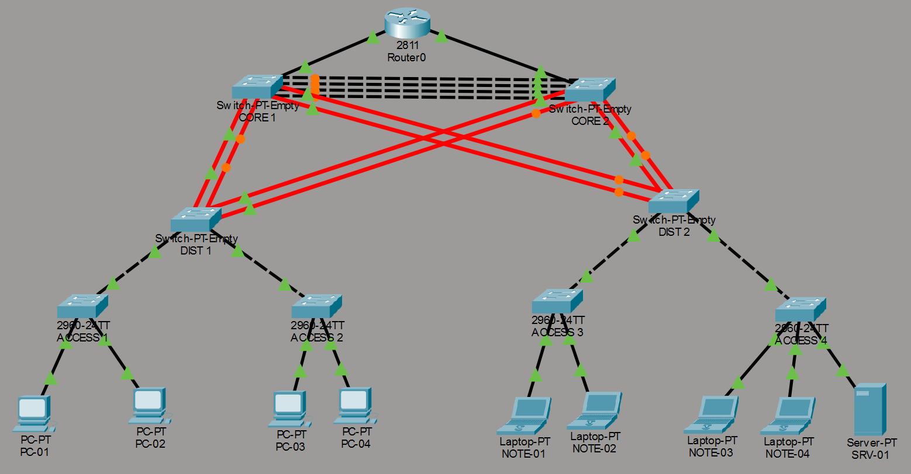
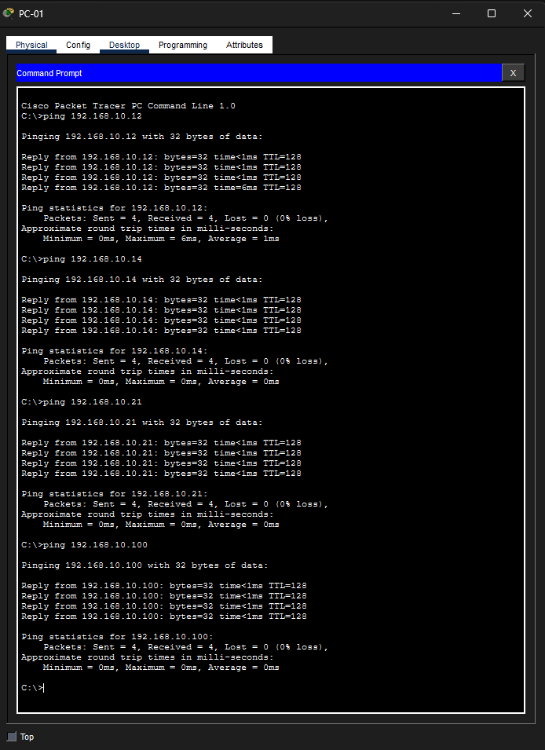
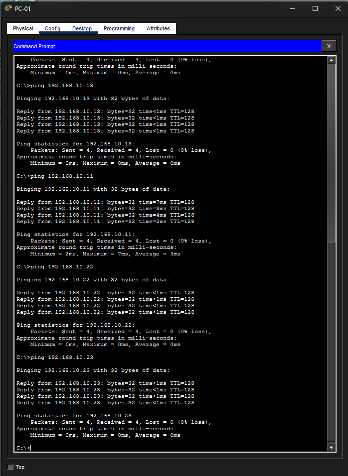
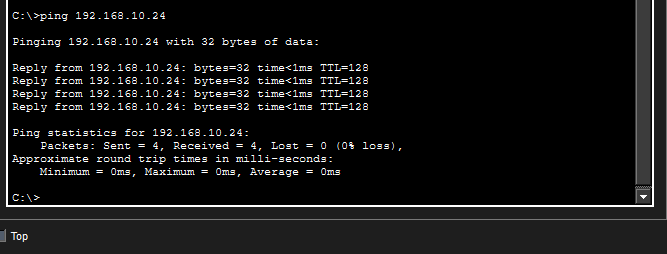

# Atividade 4 — Simulação de ambiente hierárquico de rede local

**Disciplina:** Comutação de Redes Locais (TCN.0639)
**Curso:** Tecnologia em Redes de Computadores — IFRO, Campus Porto Velho Zona Norte
**Professor:** Jhordano Malacarne Bravim
**Aluno:** [seu nome completo]
**Ferramenta:** Cisco Packet Tracer [versão que você usou]

---

## 1. Diagrama da rede

Arquivo do simulador: [Atividade4_RedeHierarquica.pkt](Atividade4_RedeHierarquica.pkt)

---

## 2. Descrição da configuração escolhida

A rede foi montada em três camadas, seguindo o modelo hierárquico de redes locais.
Cada camada tem uma função distinta e um nível de redundância diferente.

### 2.1 Camada de núcleo

| Equipamento | Modelo | Função |
|---|---|---|
| CORE 1 | Switch-PT (modular) | Comutação de alta velocidade entre distribuição e roteador |
| CORE 2 | Switch-PT (modular) | Redundância do núcleo |

Os dois switches de núcleo estão ligados entre si por **4 cabos de cobre
GigabitEthernet em paralelo**. Essas quatro portas estão fisicamente preparadas
para receber, no futuro, uma agregação de link de **4 Gbps** (4 × 1 Gbps).
A agregação ainda não foi ativada, conforme o requisito 1 da atividade,
que pede apenas as ligações físicas.

### 2.2 Camada de distribuição

| Equipamento | Modelo | Função |
|---|---|---|
| DIST 1 | Switch-PT (modular) | Agrega os switches de borda ACCESS 1 e ACCESS 2 |
| DIST 2 | Switch-PT (modular) | Agrega os switches de borda ACCESS 3 e ACCESS 4 |

Cada switch de distribuição sobe para **os dois** switches de núcleo, usando
**interfaces de fibra óptica GigabitEthernet**. Cada enlace usa **2 fibras em
paralelo**, fisicamente preparadas para uma agregação de link de **2 Gbps**
(2 × 1 Gbps). São 4 enlaces e 8 cabos de fibra no total:

| Enlace de fibra | Cabos | Preparado para |
|---|---|---|
| CORE 1 ↔ DIST 1 | 2 | 2 Gbps |
| CORE 1 ↔ DIST 2 | 2 | 2 Gbps |
| CORE 2 ↔ DIST 1 | 2 | 2 Gbps |
| CORE 2 ↔ DIST 2 | 2 | 2 Gbps |

Como no núcleo, a agregação em si não foi ativada: o requisito pede apenas a
ligação física preparada para ativação futura.

Essa ligação cruzada garante que, se um switch de núcleo falhar, a distribuição
continua alcançando o restante da rede.

### 2.3 Camada de borda (acesso)

| Equipamento | Modelo | Dispositivos conectados |
|---|---|---|
| ACCESS 1 | Cisco 2960-24TT | PC-01, PC-02 |
| ACCESS 2 | Cisco 2960-24TT | PC-03, PC-04 |
| ACCESS 3 | Cisco 2960-24TT | NOTE-01, NOTE-02 |
| ACCESS 4 | Cisco 2960-24TT | NOTE-03, NOTE-04, SRV-01 |

Cada switch de borda tem **um único cabo** subindo para a distribuição, ligado
em uma porta GigabitEthernet de uplink. Não há redundância nesta camada,
conforme o requisito 6 da atividade.

### 2.4 Roteador

O roteador **Router0** (Cisco 2811) tem duas interfaces FastEthernet nativas:

- `FastEthernet0/0` → CORE 1
- `FastEthernet0/1` → CORE 2

Atende ao requisito 3: um roteador com duas interfaces FastEthernet
ligadas a dois switches diferentes.

### 2.5 Dispositivos finais

Nove dispositivos, todos conectados com fio:

- 4 computadores desktop (PC-01 a PC-04)
- 4 notebooks (NOTE-01 a NOTE-04)
- 1 servidor (SRV-01)

### 2.6 Sobre os indicadores âmbar no diagrama

No diagrama, vários enlaces aparecem com o indicador em **âmbar** em vez de
verde, tanto nos cabos entre CORE 1 e CORE 2 quanto em pontas dos enlaces de
fibra que ligam o núcleo à distribuição.

Isso não é erro de cabeamento. São portas colocadas em **bloqueio pelo Spanning
Tree Protocol**. Como a topologia tem caminhos redundantes de propósito
(núcleo duplicado e ligação cruzada com a distribuição), o STP desativa
logicamente os caminhos excedentes para evitar loops de camada 2, mantendo
apenas um caminho ativo por vez. Se um enlace ativo cair, o STP reativa um dos
bloqueados. É exatamente o comportamento esperado numa rede com redundância.

---

## 3. Justificativa das escolhas

### 3.1 Por que Switch-PT modular no núcleo e na distribuição

Os switches de modelo fixo do Packet Tracer (2950, 2960, 3560) possuem poucas
portas GigabitEthernet e não oferecem portas de fibra óptica. O Switch-PT é
modular, o que permitiu instalar exatamente a quantidade de portas de cobre
Gigabit e de fibra Gigabit exigida pelos requisitos 4 e 5.

### 3.2 Por que 4 cabos entre os switches de núcleo

Agregação de link soma a banda dos enlaces físicos. Como cada porta
GigabitEthernet entrega 1 Gbps, são necessários 4 enlaces para alcançar os
4 Gbps pedidos no requisito 4.

### 3.3 Por que fibra entre núcleo e distribuição

A fibra foi escolhida por ser o meio indicado para enlaces de backbone: alcança
distâncias maiores que o cobre e é imune a interferência eletromagnética, que é
o cenário típico da ligação entre o núcleo e a distribuição, normalmente em
salas ou andares diferentes.

São 2 fibras por enlace pela mesma lógica do núcleo: cada porta GigabitEthernet
entrega 1 Gbps, então 2 enlaces somam os 2 Gbps pedidos no requisito 5.

Além da banda, cada switch de distribuição tem **dois caminhos independentes**
até o núcleo, um para cada switch de núcleo. Isso é o que sustenta a
disponibilidade da rede: a perda de um switch de núcleo ou de um cabo de fibra
não isola a distribuição.

### 3.4 Padrões 802.3 envolvidos

| Padrão | Onde aparece nesta rede |
|---|---|
| IEEE 802.3u | FastEthernet 100BASE-TX: roteador ↔ núcleo e dispositivos finais ↔ borda |
| IEEE 802.3ab | GigabitEthernet 1000BASE-T em cobre: núcleo ↔ núcleo e distribuição ↔ borda |
| IEEE 802.3z | GigabitEthernet 1000BASE-X em fibra: núcleo ↔ distribuição |
| IEEE 802.3ad / 802.1AX | Agregação de link (LACP), prevista para ativação futura nos 4 enlaces do núcleo |

Observação: a agregação de link foi padronizada originalmente como IEEE 802.3ad
e posteriormente transferida para o padrão IEEE 802.1AX.

### 3.5 Escalabilidade, hierarquia, redundância e disponibilidade

- **Hierarquia:** as três camadas estão separadas visualmente e por função.
- **Escalabilidade:** para crescer, basta acrescentar switches de borda na
  distribuição, sem alterar o núcleo.
- **Redundância:** o núcleo é duplicado e cada switch de distribuição tem dois
  caminhos independentes até o núcleo.
- **Disponibilidade:** a falha de um switch de núcleo, ou de um enlace de fibra,
  não derruba a rede.

---

## 4. Tipos de cabo utilizados

No diagrama, o traço da linha identifica o tipo de cabo: linha contínua preta é
cobre direto, linha tracejada preta é cobre crossover e linha vermelha é fibra.

| Ligação | Cabo |
|---|---|
| Roteador ↔ switch de núcleo | Cobre direto (straight-through) |
| Núcleo ↔ núcleo | Cobre crossover |
| Núcleo ↔ distribuição | Fibra óptica |
| Distribuição ↔ borda | Cobre crossover |
| Dispositivo final ↔ switch de borda | Cobre direto (straight-through) |

---

## 5. Endereçamento IP (item extra)

Todos os dispositivos finais foram configurados na mesma rede
**192.168.10.0/24**, máscara **255.255.255.0**.

| Dispositivo | IP |
|---|---|
| PC-01 | 192.168.10.11 |
| PC-02 | 192.168.10.12 |
| PC-03 | 192.168.10.13 |
| PC-04 | 192.168.10.14 |
| NOTE-01 | 192.168.10.21 |
| NOTE-02 | 192.168.10.22 |
| NOTE-03 | 192.168.10.23 |
| NOTE-04 | 192.168.10.24 |
| SRV-01 | 192.168.10.100 |

Como todos estão na mesma rede, a comunicação ocorre por comutação de camada 2,
sem necessidade de roteamento.

### 5.1 Teste de conectividade

O teste foi feito com o comando `ping` a partir do **PC-01**, alcançando todos
os endereços da rede. Como os destinos estão espalhados pelos quatro switches
de borda, o teste prova que o tráfego atravessa as três camadas da hierarquia.

| Destino | Dispositivo | Switch de borda | Resultado |
|---|---|---|---|
| 192.168.10.11 | PC-01 | ACCESS 1 | 4 enviados, 4 recebidos, 0% de perda |
| 192.168.10.12 | PC-02 | ACCESS 1 | 4 enviados, 4 recebidos, 0% de perda |
| 192.168.10.13 | PC-03 | ACCESS 2 | 4 enviados, 4 recebidos, 0% de perda |
| 192.168.10.14 | PC-04 | ACCESS 2 | 4 enviados, 4 recebidos, 0% de perda |
| 192.168.10.21 | NOTE-01 | ACCESS 3 | 4 enviados, 4 recebidos, 0% de perda |
| 192.168.10.22 | NOTE-02 | ACCESS 3 | 4 enviados, 4 recebidos, 0% de perda |
| 192.168.10.23 | NOTE-03 | ACCESS 4 | 4 enviados, 4 recebidos, 0% de perda |
| 192.168.10.24 | NOTE-04 | ACCESS 4 | 4 enviados, 4 recebidos, 0% de perda |
| 192.168.10.100 | SRV-01 | ACCESS 4 | 4 enviados, 4 recebidos, 0% de perda |

**Nenhum pacote foi perdido em nenhum dos testes.** A maioria das respostas veio
em menos de 1 ms; os primeiros pacotes de alguns destinos levaram alguns
milissegundos a mais, tempo gasto com a resolução ARP inicial.

Prints do teste:

